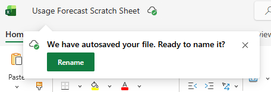
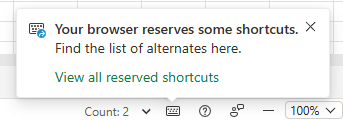
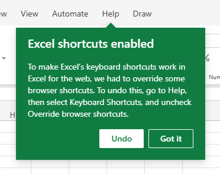
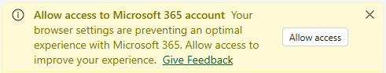

# Excel Online Pop-Up Blocker

   

A Chromium extension that suppresses recurring Excel Online pop-ups, dialogs, and prompts that can interrupt work, steal keyboard focus, or get in the way of hotkeys and shortcuts.

All suppression options are opt-in. Changes to Excel Online behavior are made only at the user's discretion. This extension is not affiliated with Microsoft.

**Version:** 2.1.2

---

## Blockable Pop-Ups <small>- Instantly remove interruptive pop-ups</small>

Automatically close or delete the element whenever an interruptive pop-up appears:

- **Calendar Pop-Up**
  - The date picker that blocks view of everything to the right of your cell when you press `Ctrl+;`
- **Renaming Prompt**
  - *"We have autosaved your file. Ready to name it?"* (sometimes appears and blocks keyboard inputs after pressing `Ctrl+S`)
  
- **Need More Working Space?**
  - *"Need more working space?" / "Looks like your display is not optimised." / "Toggle FullScreen to maximise screen space."*
- **Reserved Shortcut Pop-Up**
  - *"Your browser reserves some shortcuts." / "Find the list of alternatives here."* (sometimes appears and blocks hotkey inputs <u>while using hotkeys</u>)
  
- **Ctrl Paste Menu**
  - The paste options menu that pops up after you paste with `Ctrl+V`

## Auto-Approvable Pop-Ups <small>- Instantly approve annoying dialogs</small>

Automatically select an option when a particular pop-up appears:

- **Workbook Locked**
  - *"Someone has this workbook locked" / "___ has locked this file for editing. This may happen if they're using a non-subscription version of Excel. Ask them to close the file or check it in."* → ***Continue in reading view***
- **Excel Shortcuts Enabled**
  - *"Excel shortcuts enabled" / "To make Excel's keyboard shortcuts work in Excel for the web, we had to override some browser shortcuts. To undo this, go to Help, then select Keyboard Shortcuts, and uncheck Override browser shortcuts."* → ***Got it***
  
- **Frozen Rows/Columns Won't Scroll**
  - *"Frozen rows/columns won't scroll" / "The visible area of your grid contains only frozen rows/columns, which will not scroll. To scroll, unfreeze the rows/columns, change the size of the Excel window, or zoom out."* → ***Cancel***
- **Editing Session in Progress**
  - *"Editing session in progress" / "Other people are already editing this workbook. You can join their editing session, but you will lose any changes you have made so far. Would you like to join the existing editing session anyway?"* → ***Yes***
- **Session Expired (Sign In)**
  - *"Your session has expired. Please sign in again to continue working."* → ***Sign in***
  .png)
- **Session Expired (Refresh)**
  - *"Sorry, your session has expired. Please refresh the page to continue."* → ***Refresh***
- **Session About to Expire**
  - *"Your session is about to expire" / "Your organization's policy enforces automatic sign out after a period of inactivity on Office 365 web applications." / "Do you want to stay signed in?"* → ***Stay signed in***

## Auto-Closeable Pop-Ups <small>- Instantly dismiss repetitive banners</small>

Automatically dismiss or close the following pop-ups:

- **Can't Edit Workbook Dialog**
  - *"Can't Edit Workbook" / "Someone has this workbook locked" / "We're sorry. We couldn't lock this file for editing. Would you like to try again?"*
- **Trust Workbook Links Banner**
  - *"Trust workbook links? This workbook links to data in external workbooks."*
- **Unable to Refresh Links Banner**
  - *"UNABLE TO REFRESH. We couldn't get updated values from a linked workbook."*
- **Microsoft 365 Access Banner**
  - *"Allow access to Microsoft 365 account" "Your browser settings are preventing an optimal experience with Microsoft 365. Allow access to improve your experience."*
  

## Custom Rules

You can also add your own rule if Excel invents a new annoying dialog:

1. **Name**: what you want to call it in the list of pop-up blockers
2. **Pop-Up Text**: the exact words that appear on the pop-up (so that the extension can find it)  
3. **Button Label**: the button’s `aria-label` (usually the exact text of the button; many X / close buttons use `Close`)

---

## Installation (unpacked Chromium extension)

1. Clone or download this repository.
2. Open Chrome and go to `chrome://extensions`.
3. Enable **Developer mode**.
4. Click **Load unpacked** and select this project folder (the one containing `manifest.json`).
5. (Optional) Pin the extension for easy access: click the puzzle-piece **Extensions** icon in Chrome’s toolbar, find **Excel Online Pop-Up Blocker**, and click the pin icon.

After updating to a new version, click **Reload** on the extension card in `chrome://extensions`.

## Usage

1. Click the extension icon to open the popup.
2. Enable the rules you want under **Block**, **Auto-Approve**, or **Auto-Close**.
3. (Optional) Use **Add New Row** under Auto-Approve / Auto-Close to create custom rules.
4. (Optional) Check **Enable Desktop Notifications** for the satisfaction of knowing when pop-ups are being blocked.
5. (Optional) Use **View Logs** in Settings to review recent suppressions and errors.

## Currently Supported Domains

Works on Excel Online iframes matching:

- `https://usc-excel.officeapps.live.com/*`
- `https://excel.officeapps.live.com/*`
- `https://officeonline.sfcollab.org/*`

Please contact the developer or directly modify the unpacked manifest.json if you would like additional domains to be supported.

---

## Disclaimer

This extension is not affiliated with Microsoft. Use it responsibly. You are responsible for any change it makes to Excel Online behavior, including dialogs that may relate to editing, sessions, trust, or access.

---

## License

MIT — see [LICENSE.md](LICENSE.md).
